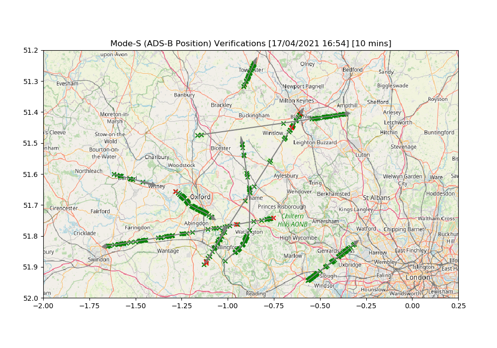

# Automatic PHY-layer Fingerprinting

This project implements an end-to-end system for automatic fingerprinting of transmitters at the physical layer, incorporating capture, demodulation, model training, fingerprinting, fingerprint tracking and visualisation.

The system is built on a modular framework to permit simple variation at each stage. 

At present the framework is validated with a concrete example for 1090 MHz ADS-B traffic, developed for this project. 

### Architecture

The system comprises several components:

 

| Component | Description |
| --- | --- |
| Signal Capture | Retrieval of a raw signal. Compatible with either software radio frameworks (e.g., GNURadio) or other digital capture (e.g., storage oscilloscopes). |
| Demodulation | Interface to 3rd party demodulation code for message validation and data extraction. |
| Identifier Masking | A pre-processing stage to remove in-message identifiers, which lead to trivial solutions |
| Fingerprint Extraction and Comparison | A Siamese network model used to derive comparisons between received messages across observed transmitters. |
| Message Verification | Long-term tracking of message fingerprint comparisons and identity verification |

In addition to the main pipeline, some additional components are implemented to help study the data:
| Component | Description |
| --- | --- |
| Storage | Storage components receive bursts and write them to files for offline processing (e.g. model training). At present there are two storage components: one writing bursts to an HDF5 file, one writing decoded messages to an SQLite3 database. |
| Visualisation | A message verification visualisation is implemented for the ADS-B case, in which messages are displayed along with their verification status. |
| Supporting (Weather) | A supporting component retrieves and stores data on local weather conditions. |

Data transfer between stages is principally through ZMQ message queues in a PUB/SUB pattern. Each part of the pipeline outputs received bursts, along with appropriate metadata, and forwards them to all subscribers. Alternatively, data can be written to files at each stage, for offline processing -- however as the streaming model accomplishes most tasks more easily, the file-based method is now deprecated. 

### Installation

#### Dependencies

On host:

* Docker
* SecLab Docker images for GNURadio (https://github.com/ssloxford/docker-gnuradio)

Included within containers:

* Python 3
	* numPy, pyplot, h5py
	* pySDRBurstfile (https://gitlab.com/sdrburstfile/pysdrburstfile)
* Ettus USRP UHD
* GNURadio
	* gr-burstfile
	* gr-triggers
* Tensorflow 2, Keras
* ZMQ
* Bokeh

#### Process

0. Clone and build base gnuradio images
TODO
0. `git clone --recursive https://github.com/ssloxford/auto-phy-fingerprint`
0. Build capture container

	0. `cd auto-phy-fingerprint/capture/adsb-gr-burst-capture/`
	0. `./build.sh`
0. Configure capture container

	0. Edit run.sh with directory mapping for saved burst files
0. Build demodulation container

	0. `cd ../..`
	0. `cd demod/adsb-libmodes-demod`
	0.  `./build.sh`
0. Build fingerprinting container

	0. `cd ../..`
	0. `cd fingerprinting/adsb-siamese`
	0. Configure Dockerfile with either CPU or GPU Tensorflow base image
	0. `./build.sh`
	0. Configure run.sh to match CPU/GPU choice
0. Build storage container
0. Build visualisation container

### Use

* Start the capture container
	* `capture/adsb-gr-burst-capture/run.sh`
* Start the demodulation container
	* `demod/adsb-libmodes-demod/run.sh <burst file name>`
* Start the message verifier
	* `fingerprinting/adsb-siamese/run.sh`

### ADS-B Verification Example

To illustrate the behaviour of the framework, a concrete example for the fingerprinting of ADS-B traffic is implemented. The system in under active developement and has not yet undergone a substantial evaluation. Nonetheless, initial testing shows the system to perform moderately, albeit underperforming the state of the art (see Related Work) at present.

The ADS-B verifier operates under the following threat model:

* The system is developed under a threat model that considers compromised devices and low-resourced SDR attackers. Key to both of these is that the attacker is not able to fully match the physical characteristics of another transmitter (although they may do so to some extent). 
* The system does not, at present, attempt to protect against a well-resourced SDR attacker. In this case the attacker is able to mimic another transmitter with arbitrary precision. 

The ADS-B example collects data at two sites, using inexpensive, commodity hardware at each. 

Site 1:

* 1090 MHz monopole
* Nooelec LaNA amplifier
* DC block
* Ettus USRP b205i-mini
* Intel NUC D54250WYK (Intel Core i5-4250U)

Site 2:

* 1090 MHz discone
* Ettus USRP b205i-mini
* Dell OptiPlex 7040 (Intel Core i7-6700)

Model training makes use of a dedicated computer (Intel Xeon Silver 4210, NVIDIA Tesla V100). 

A Siamese model design is implemented, comparing raw IQ signals between two collected messages in an initial training phase. The model is then used to verify collected messages, tracking a long-term fingerprint for each and comparing each message to that baseline.

#### Preliminary Results

N-way testing, using combined dataset collected at Site 1 in April 2021:

 

Verifications of a short sample of the above dataset:

 

(OpenStreetMap)

### Related Work

* T. Jian et al., ‘Deep Learning for RF Fingerprinting: A Massive Experimental Study’, IEEE Internet Things M., vol. 3, no. 1, pp. 50–57, Mar. 2020, doi: 10.1109/IOTM.0001.1900065.

* S. Chen, S. Zheng, L. Yang, and X. Yang, ‘Deep Learning for Large-Scale Real-World ACARS and ADS-B Radio Signal Classification’, IEEE Access, vol. 7, pp. 89256–89264, 2019, doi: 10.1109/ACCESS.2019.2925569.

* Z. L. Langford, ‘Robust Signal Classification Using Siamese Networks.’, pp. 1–5, 2019, doi: 10.1145/3324921.3328781.

* X. Ying, J. Mazer, G. Bernieri, M. Conti, L. Bushnell, and R. Poovendran, ‘Detecting ADS-B Spoofing Attacks using Deep Neural Networks’, arXiv:1904.09969 [cs], Apr. 2019, Accessed: Nov. 17, 2020. [Online]. Available: http://arxiv.org/abs/1904.09969.

* K. Sankhe, M. Belgiovine, F. Zhou, S. Riyaz, S. Ioannidis, and K. Chowdhury, ‘ORACLE: Optimized Radio clAssification through Convolutional neuraL nEtworks’, in IEEE INFOCOM 2019 - IEEE Conference on Computer Communications, Paris, France, Apr. 2019, pp. 370–378, doi: 10.1109/INFOCOM.2019.8737463.

### Acknowledgements

This project is supported by InnovateUK under the HICLASS project. 
